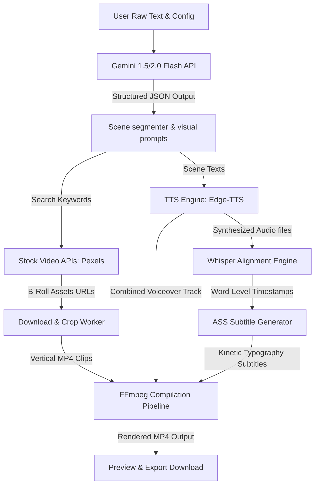

# 🎬 ViralReel.AI — 100% Free-Tier AI Reel Generator

🚀 **Live Space Demo**: [AI_Reel_Generator on Hugging Face Spaces](https://huggingface.co/spaces/pranalibose/AI_Reel_Generator)

ViralReel.AI is a premium, open-source dashboard designed to generate engaging, 9:16 portrait videos (TikToks, YouTube Shorts, Instagram Reels) from raw script or topic texts. 

The core architecture is built around a **$0.00 operational cost model**, strictly leveraging free-tier APIs, local voice synthesis, local audio-word alignment models, and free stock asset scrapers.

---

## 🚀 System Architecture & Data Flow

Below is the execution pipeline that takes raw user scripts and translates them into a compiled, captioned short-form video:



---

## 🛠️ Prerequisites & System Dependencies

Before you begin, you must install several system-level utilities and obtain credentials for the external API integrations.

### 1. System Packages

The video compilation engine requires **FFmpeg** and **FFprobe** to be installed on your host system and registered in your system `PATH`.

####  macOS (via Homebrew)
```bash
brew install ffmpeg
```

#### 🐧 Linux (Debian/Ubuntu)
```bash
sudo apt update
sudo apt install -y ffmpeg
```

#### 🪟 Windows (via Chocolatey or Scoop)
```bash
# Using Chocolatey
choco install ffmpeg

# Using Scoop
scoop install ffmpeg
```
*Alternatively, download the binaries directly from the [Official FFmpeg Website](https://ffmpeg.org/download.html) and add the `/bin` directory manually to your system's Environmental variables (`PATH`).*

### 2. Python Environment
* Python **3.11** or higher is recommended.
* Verify your python installation:
  ```bash
  python3 --version
  ```

---

## 🔑 External API Key Guides

The application uses Google Gemini to segment scripts, and Pexels/Pixabay to fetch vertical background clips. You can obtain all required keys completely free of charge:

### 🟢 Google Gemini API Key
Used to dynamically segment the raw input script into chronological storyboard scenes with visual search keywords.
1. Visit the [Google AI Studio](https://aistudio.google.com/) portal.
2. Sign in with your Google account.
3. Click on the **Get API Key** button in the sidebar.
4. Click **Create API Key**. You can choose to associate it with a Google Cloud project or use the default setup.
5. Copy the generated key. It will start with `AIzaSy...`.
6. Insert it into the `.env` file under `GEMINI_API_KEY`.

### 🟢 Pexels API Key
Used to retrieve high-definition vertical video assets (B-rolls) programmatically.
1. Sign up for a free developer account at [Pexels](https://www.pexels.com/join/).
2. Once registered, head directly to the [Pexels API Documentation](https://www.pexels.com/api/).
3. Locate the **Request API Key** section.
4. Fill out the brief application form. (Applications for the default free tier are automatically approved instantly).
5. Copy the API key.
6. Insert it into the `.env` file under `PEXELS_API_KEY`.

### 🟡 Pixabay API Key (Optional Fallback)
Provides an alternative backup stock library.
1. Go to the [Pixabay API Documentation](https://pixabay.com/api/docs/).
2. Log in or create an account.
3. Scroll down to the **Parameters** section. Your unique API key will be displayed directly inside the documentation page text block (e.g., `key (required): your_key_here`).
4. Copy the key and insert it under `PIXABAY_API_KEY`.

---

## ⚙️ Project Setup & Configuration

Follow these step-by-step instructions to get the application running locally from scratch.

### Step 1: Clone & Navigate to Backend
Navigate to the `backend` subdirectory where the Python API engine resides:
```bash
cd backend
```

### Step 2: Set up a Python Virtual Environment
We recommend utilizing a virtual environment to manage dependencies locally:
```bash
# Create the environment
python3 -m venv venv

# Activate it:
# On macOS / Linux:
source venv/bin/activate

# On Windows (Command Prompt):
venv\Scripts\activate.bat

# On Windows (PowerShell):
venv\Scripts\Activate.ps1
```

### Step 3: Install Dependencies
Install all package requirements listed in `requirements.txt`:
```bash
pip install --upgrade pip
pip install -r requirements.txt
```

> [!NOTE]
> By default, the application will attempt to load `faster-whisper`.
> If your system lacks a compatible CPU configuration (e.g., standard C++ runtimes), the backend will automatically fall back to a **linear heuristic alignment algorithm** to ensure the app continues to function.

### Step 4: Environment Configuration
Create a `.env` file inside the `backend` folder (or edit the existing placeholder template) with the following structure:

```env
# Google Gemini API Key (https://aistudio.google.com/)
GEMINI_API_KEY="your_gemini_api_key_here"

# Pexels API Key (https://www.pexels.com/api/)
PEXELS_API_KEY="your_pexels_api_key_here"

# Pixabay API Key (https://pixabay.com/api/docs/)
PIXABAY_API_KEY="your_pixabay_api_key_here"

# Local directories structure (relative to backend path)
CACHE_DIR="./cache"
OUTPUT_DIR="./static/outputs"
VOICEOVER_DIR="./static/voiceovers"
LOFI_TRACKS_DIR="./static/lofi"
```

### Step 5: Add Background Lofi Tracks (Optional)
If you want the final video to include royalty-free background lofi music, copy one or more `.mp3` or `.wav` files into the `backend/static/lofi/` directory.
* If a music file is present, the rendering compositor will automatically apply **sidechain audio ducking** (reducing the music volume by `-18dB` whenever the voiceover narration track is active).
* If no music tracks are found in the directory, the video compiles with the voiceover track alone.

---

## 🏃 Running the Application

### 1. Launch the FastAPI Backend
Start the server using `uvicorn`. Ensure you are inside the `backend/` directory with your virtual environment activated:
```bash
uvicorn main:app --reload --port 8000
```
The console will display:
```
INFO:     Started server process [12345]
INFO:     Waiting for application startup.
INFO:     Application startup complete.
INFO:     Uvicorn running on http://127.0.0.1:8000 (Press CTRL+C to quit)
```

### 2. Run the Frontend Dashboard
Since the frontend consists of static files (`index.html`, `style.css`, and `app.js`), you must serve them using a local web server to avoid browser CORS errors when issuing requests to the backend:

#### Option A: Using Python (Recommended)
From the **root folder** of the project (where `index.html` is located):
```bash
python3 -m http.server 3000
```
Now, open your browser and navigate to: `http://localhost:3000`

#### Option B: Using Node (npx)
```bash
npx serve -l 3000
```

#### Option C: Live Server Extension
If you are using VS Code, you can click **Go Live** on the bottom-right status bar with `index.html` open.

---

## 💡 Under the Hood: Key Pipeline Implementations

### LLM Prompting Structure
The backend provides Gemini with a strict schema to partition text content into 3-to-7 second scene chunks. This ensures that the generated output fits within standard short-form attention spans.

```python
# From backend/services/llm_service.py
class SceneItem(BaseModel):
    scene_id: int
    text: str
    search_query: str
    visual_prompt: str
```

### Word-Level Subtitle Highlights
Word-level timestamps are mapped to dialogue records in an **Advanced SubStation Alpha (.ass)** script file. Rather than flashing words one-by-one, the script groups full phrases and dynamically injects color tags (`\c&H00FFFF&`) onto the exact active word.

```ass
[Events]
Dialogue: 0,0:00:00.05,0:00:00.22,Default,,0000,0000,0000,,{\c&H00FFFF&}The{\c&HFFFFFF&} single biggest mistake
Dialogue: 0,0:00:00.25,0:00:00.58,Default,,0000,0000,0000,,The {\c&H00FFFF&}single{\c&HFFFFFF&} biggest mistake
Dialogue: 0,0:00:00.61,0:00:00.92,Default,,0000,0000,0000,,The single {\c&H00FFFF&}biggest{\c&HFFFFFF&} mistake
```

### FFmpeg ducking filter
Audio ducking is achieved programmatically by compressing the lofi loop dynamically based on speech output level:
```bash
[speech][music]sidechaincompress=threshold=0.15:ratio=12:level_in=1.0:level_out=1.0
```

---

## 🛠️ Troubleshooting FAQ

#### Q: I get `FileNotFoundError` or `Command 'ffmpeg' not found`.
**A**: Ensure FFmpeg is installed and added to your path. Run `ffmpeg -version` in your terminal to verify that your operating system can run the binary.

#### Q: The subtitle font looks generic or is missing.
**A**: The subtitle stylesheet specifies `Plus Jakarta Sans` as the default font. If it isn't installed locally on your operating system, FFmpeg will fall back to a system default font (like Arial or Sans). You can install the font by downloading it from Google Fonts.

#### Q: `faster-whisper` fails to compile or install.
**A**: `faster-whisper` requires specific DLLs/shared libraries (like `ctranslate2`). If your OS encounters compilation errors, uninstall it (`pip uninstall faster-whisper`) or ignore the error. The app automatically detects this and switches to the built-in heuristic/linear timing calculation, allowing the rest of the application to run normally.

#### Q: I receive CORS errors when submitting scripts from the dashboard.
**A**: Ensure you are serving the frontend using a local server (like Python's `http.server` or Node's `serve`) instead of opening the HTML file directly as a local path (`file:///...`).

---

## ☁️ Cloud Deployment Guide (Hugging Face Spaces)

Follow these steps to deploy this application to the cloud for free using Hugging Face Spaces:

### 1. Create a Hugging Face Account
If you don't have one, sign up for a free account at [Hugging Face](https://huggingface.co/).

### 2. Create a New Space
1. Navigate to [Hugging Face Spaces](https://huggingface.co/spaces) and click **Create new Space**.
2. Fill out the following options:
   * **Space name**: Enter a name (e.g., `ai-viral-reel-generator`).
   * **License**: Select `apache-2.0` (or leave it blank).
   * **SDK**: Select **Docker**.
   * **Docker template**: Select **Blank** (do not select Gradio/Streamlit).
   * **Space visibility**: Public or Private.
3. Click **Create Space**.

### 3. Set Up API Keys (Secrets)
Hugging Face will run your app in a secure container. You must provide the API keys via the Space settings:
1. Inside your newly created Space, click on the **Settings** tab (gear icon at the top right).
2. Scroll down to **Variables and secrets**.
3. Under the **Secrets** section, click **New secret** to add two variables:
   * **Key**: `GEMINI_API_KEY` | **Value**: *[Your Google AI Studio Key]*
   * **Key**: `PEXELS_API_KEY` | **Value**: *[Your Pexels Developer API Key]*

### 4. Clone and Push Your Code
You can push your files using Git. In your terminal:
1. Clone the empty space repository to your local machine:
   ```bash
   git clone https://huggingface.co/spaces/YOUR_USERNAME/YOUR_SPACE_NAME
   ```
2. Copy all the files from this project into the cloned Space folder. Ensure that the root of your Space folder contains the following structure:
   ```
   ├── Dockerfile
   ├── README.md
   ├── index.html
   ├── style.css
   ├── app.js
   └── backend/
       ├── main.py
       ├── requirements.txt
       └── services/
   ```
3. Open the `README.md` file inside the cloned folder and verify it starts with this configuration block (this YAML frontmatter configures the Space card and must be present at the very top of `README.md`):
   ```yaml
   ---
   title: AI Reel Generator
   emoji: 🎬
   colorFrom: purple
   colorTo: indigo
   sdk: docker
   pinned: false
   ---
   ```
4. Stage, commit, and push the files to Hugging Face:
   ```bash
   git add .
   git commit -m "Deploy ViralReel.AI"
   git push origin main
   ```
   *(Note: Hugging Face uses access tokens for git password authentication. Generate one at Hugging Face -> Settings -> Access Tokens).*

### 5. Watch the Build and Run!
Go to the **App** tab of your Hugging Face Space. The status will show **Building**. You can click **Logs** to watch the Docker container compile:
1. It installs system dependencies (`ffmpeg`).
2. It installs the Python environment dependencies (`fastapi`, `faster-whisper`, etc.).
3. Once completed, the badge will turn to a green **Running** state, and the app will load right inside your Hugging Face Space page.

