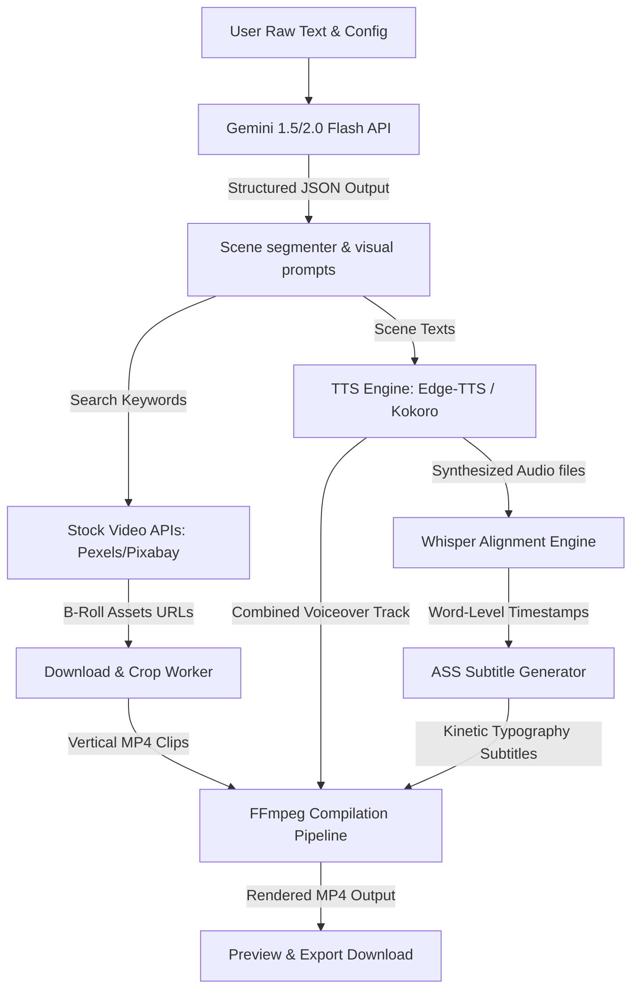

# System Architecture Design Document: Viral Reel Generator (100% Free-Tier AI)

This document specifies the technical design, system architecture, and pipeline implementation details for the **Viral Reel Generator** dashboard. The primary architectural constraint is to achieve a **$0.00 operational cost per video generated** by exclusively leveraging free-tier APIs, local inference, and open-source utilities.

---

## 1. Architectural Goals & Constraints

*   **Zero-Cost Execution ($0.00):** No usage of paid APIs (e.g., OpenAI, ElevenLabs). Utilize Google Gemini's free tier, open-source local Text-to-Speech (TTS), local Whisper alignment, and free stock asset APIs.
*   **High Performance & Low Latency:** Complete video rendering in under 60 seconds for a typical 30-to-60-second short-form reel.
*   **Aesthetic Subtitles (Kinetic Typography):** Exact word-level subtitle alignment synced with synthesized voice, matching modern viral caption trends (e.g., active word highlighting, high-contrast outline).
*   **9:16 Portrait Formatting:** Dynamic asset clipping, scaling, and composition for social media platforms (TikTok, YouTube Shorts, Instagram Reels).

---

## 2. Overall Pipeline & Data Flow

The architecture operates on a sequential pipeline that progresses from raw text to structured scenes, audio synthesis, alignment, asset acquisition, and final video rendering.



---

## 3. Tech Stack & Free-Tier Ecosystem

| Component | Technology | Cost / Free Tier Limits | Rationale |
| :--- | :--- | :--- | :--- |
| **Frontend UI** | HTML5, CSS3, Vanilla JS, Lucide Icons | $0 (Self-hosted or GitHub Pages) | Lightweight, zero dependency, responsive styling, SVG icons. |
| **Backend Framework** | Python 3.11 with FastAPI | $0 (Localhost, or Free Tier Render/Hugging Face Spaces) | Asynchronous, auto-generates Swagger docs, handles binary media streaming. |
| **LLM & Structuring** | Google Gemini 1.5 Flash / 2.0 Flash | $0 (Google AI Studio Free Tier: 15 RPM, 1500 RPD) | High speed, generous free limit, supports structured JSON output format natively. |
| **Voice Synthesis (TTS)**| Kokoro-TTS / Edge-TTS | $0 (Open-Source / Free local inference) | **Kokoro** is a ultra-lightweight (82M params) TTS that runs locally on CPU under 1 second. **Edge-TTS** provides Microsoft Edge's premium cloud voices without API keys. |
| **Word Alignment (STT)**| Faster-Whisper (local tiny/base model) | $0 (Open-Source / Runs on local CPU) | Generates word-level timestamps with high accuracy on short voice files. |
| **B-Roll Visual Assets** | Pexels API & Pixabay API | $0 (Pexels: 20k requests/mo; Pixabay: 5k/hr) | Direct programmatic retrieval of high-definition 9:16 vertical video assets. |
| **Video Compositor** | FFmpeg (compiled with libass & h264) | $0 (Open-Source) | Fast command-line binary to trim, crop, overlay audio, duck tracks, and render ASS captions. |

---

## 4. Detailed Component Design

### 4.1. LLM Structuring Engine (Gemini API)
The user enters a raw script or topic, selects a tone (e.g., Bold, Curious, Informative), and a template style. The backend invokes the Gemini API using `response_schema` to enforce structured JSON output.

**Prompting Strategy:**
```
You are an expert short-form video scriptwriter. Segment the following text into sequential scenes (each 3 to 7 seconds of spoken text). For each scene, write:
1. The exact spoken text (narrative).
2. A single highly search-optimized query keyword/phrase suitable for retrieving a stock video (B-roll) on Pexels/Pixabay (e.g., "developer typing code close up", "person tracking chart lofi").
3. A visual prompt description.

Format your output STRICTLY as a JSON object matching the requested schema.
```

**JSON Output Schema:**
```json
{
  "scenes": [
    {
      "scene_id": 1,
      "text": "The single biggest mistake content creators make is focusing on views instead of retention.",
      "search_query": "frustrated content creator laptop",
      "visual_prompt": "A close up of a person looking stressed at their laptop screen, low lighting."
    },
    {
      "scene_id": 2,
      "text": "If you don't hook them in the first three seconds, they are gone forever.",
      "search_query": "scrolling phone fast",
      "visual_prompt": "Close up of fingers scrolling rapidly through a social media feed on a smartphone."
    }
  ]
}
```

### 4.2. TTS Synthesis Engine
We support two zero-cost options to compile voiceovers:
1.  **Edge-TTS (Default Cloud Free):** Uses Microsoft's read-aloud service. No API keys are required, and synthesis is done via an asynchronous Python client (`pip install edge-tts`).
2.  **Kokoro-TTS (Local Inference):** An 82M parameter PyTorch/ONNX model. It provides premium studio-quality voices (comparable to ElevenLabs) and can be executed locally in-process or containerized on a free Hugging Face Space.

*Output:* Individual audio segments (e.g., `scene_1.mp3`, `scene_2.mp3`) which are concatenated into a master voiceover track (`voiceover.mp3`) using FFmpeg.

### 4.3. Word-Level Forced Alignment (Whisper-Tiny)
To display kinetic captions (word-by-word highlight matching the speaker), we must acquire the exact start and end timestamps for every word in the voiceover.
We utilize `faster-whisper` running the `tiny` or `base` English model locally on CPU.
*   **Process:** Feed `voiceover.mp3` and the master text script back to the Whisper alignment engine.
*   **Result:** A JSON list containing word-level timestamps:
    ```json
    [
      {"word": "The", "start": 0.05, "end": 0.22},
      {"word": "single", "start": 0.25, "end": 0.58},
      {"word": "biggest", "start": 0.61, "end": 0.92}
    ]
    ```

### 4.4. Visual Asset Fetcher (Pexels / Pixabay Client)
For each scene, the backend sends the `search_query` string to the Pexels API.
1.  **Query URL:** `https://api.pexels.com/v1/videos/search?query={search_query}&per_page=5&orientation=portrait`
2.  **Selection Logic:** The downloader parses the response and downloads the first video file with a width of `1080` and height of `1920` (or crops a landscape video if no portrait option is available).
3.  **Duration Sync:** The video clip is downloaded and stored temporarily. If the video clip is shorter than the scene duration, it is looped. If it is longer, it is trimmed to the exact scene duration.

### 4.5. FFmpeg Rendering Pipeline & ASS Typography
The rendering engine is written in Python, orchestrating command-line `ffmpeg` calls.

#### Subtitle Formatting (ASS Styles)
To display kinetic subtitles, the Whisper word timestamps are compiled into an **Advanced SubStation Alpha (.ass)** script. The ASS script allows styling that dynamically colors the active word:
```ass
[Script Info]
PlayResX: 1080
PlayResY: 1920

[V4+ Styles]
Format: Name, Fontname, Fontsize, PrimaryColour, SecondaryColour, OutlineColour, BackColour, Bold, Italic, Underline, StrikeOut, ScaleX, ScaleY, Spacing, Angle, BorderStyle, Outline, Shadow, Alignment, MarginL, MarginR, MarginV, Encoding
Style: Default,Plus Jakarta Sans,72,&HFFFFFF,&H0000FF,&H000000,&H000000,-1,0,0,0,100,100,0,0,1,6,0,5,10,10,400,1

[Events]
Format: Layer, Start, End, Style, Name, MarginL, MarginR, MarginV, Effect, Text
Dialogue: 0,0:00:00.05,0:00:01.20,Default,,0000,0000,0000,,{\rDefault}{\c&H00FFFF&}The{\c&HFFFFFF&} single biggest mistake
Dialogue: 0,0:00:00.25,0:00:01.20,Default,,0000,0000,0000,,The {\c&H00FFFF&}single{\c&HFFFFFF&} biggest mistake
Dialogue: 0,0:00:00.61,0:00:01.20,Default,,0000,0000,0000,,The single {\c&H00FFFF&}biggest{\c&HFFFFFF&} mistake
```
*Note: `\c&H00FFFF&` applies a yellow/cyan color override to the specific word during its spoken interval.*

#### FFmpeg Complex Filter Graph
The final compilation performs the following actions:
1.  Concatenates the scene video files.
2.  Binds the voiceover track.
3.  Adds a background royalty-free lofi track (preset loop).
4.  Applies audio ducking: reduces background music volume by -18dB whenever the voiceover track has active signal.
5.  Overlays the ASS kinetic typography.
6.  Exports to H.264 MP4.

```bash
ffmpeg -y \
  -i combined_scenes.mp4 \
  -i voiceover.wav \
  -i lofi_bg_loop.wav \
  -filter_complex "[2:a]volume=0.08[bg];[1:a]volume=1.0[speech];[speech][bg]sidechaincompress=threshold=0.15:ratio=12:level_in=1.0:level_out=1.0[outa];[0:v]ass=subtitles.ass[outv]" \
  -map "[outv]" \
  -map "[outa]" \
  -c:v libx264 \
  -preset fast \
  -crf 22 \
  -c:a aac \
  -b:a 192k \
  output_viral_reel.mp4
```

---

## 5. Security & Rate Limiting Strategies

Since the pipeline relies entirely on the free tiers of public APIs, defensive architectural boundaries are set to prevent failures:

1.  **Caching Layer:** All downloaded Pexels clips are cached locally based on their search query hash. If multiple scenes request similar B-roll (e.g., "coding layout"), the asset is read from cache, avoiding redundant downloads and Pexels rate limits.
2.  **API Fallbacks:** If Gemini API hits standard rate limiting (15 Requests Per Minute):
    *   The backend retries with exponential backoff.
    *   If failed, it drops down to a local open-source LLM (such as Llama 3 via Ollama) or falls back to basic sentence splitting with stock prompts if running completely offline.
3.  **Local TTS Cache:** Synthesized voice fragments of individual sentences are cached (key = MD5 hash of text sentence + voice name). Re-generating a storyboard after simple text tweaks only re-synthesizes modified scenes.

---

## 6. Development Checklist & Implementation Stages

- [ ] **Stage 1: Local Backend Boilerplate**
  - Set up FastAPI app and environment config (`.env` for API Keys).
  - Write standard response schemas and error handlers.
- [ ] **Stage 2: AI Pipeline Hookups**
  - Integrate `google-generativeai` package to invoke Gemini Flash.
  - Implement Edge-TTS / local Kokoro-TTS wrapper in Python.
  - Set up local Faster-Whisper worker.
- [ ] **Stage 3: Asset Downloader & Cache**
  - Create Pexels/Pixabay API fetcher with query fallback logic.
  - Implement multi-threaded download manager with a local disk cache.
- [ ] **Stage 4: FFmpeg Compositing Engine**
  - Write helper class to compile Whisper timestamps into `.ass` subtitle format.
  - Construct the FFmpeg filter complex dynamically based on scene lengths.
  - Add logic for sidechain compression (voiceover audio ducking).
- [ ] **Stage 5: Frontend Connect**
  - Update `app.js` mock generators to make real HTTP calls to the local FastAPI backend.
  - Handle stream responses / loading status indicators in UI.
